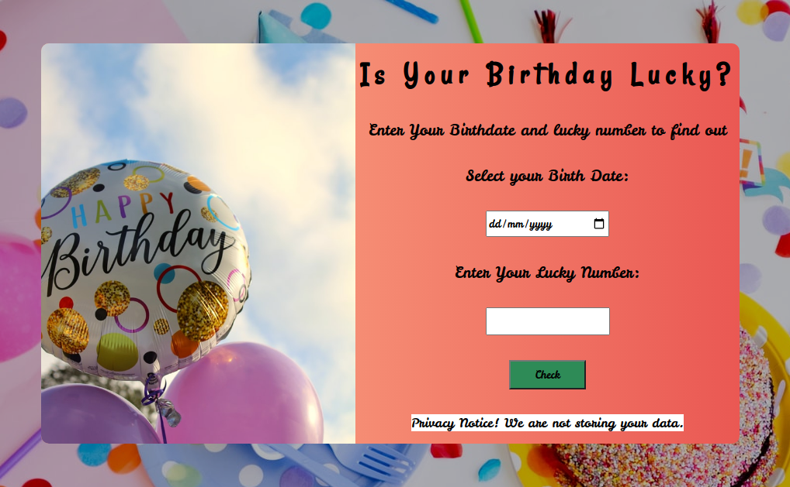

# neoG - Mark-11 Lucky Birthday

This is a solution to the [Mark-11 of neoG camp](https://neog.camp/guide/mark-11).

## Table of contents

- [Overview](#overview)
  - [The challenge](#the-challenge)
  - [Screenshot](#screenshot)
  - [Links](#links)

## Overview
- Check if your Birthday is lucky or not.

### The challenge

- Take user's complete birthday
- And his/her lucky number.
- Now, find out if the sum of digits of birthday is divisible by the lucky number.
- Show the result to the user.

### Screenshot

### Links

[- Live Site URL](https://git-0r.github.io/mark11_luckyBirthday/)
